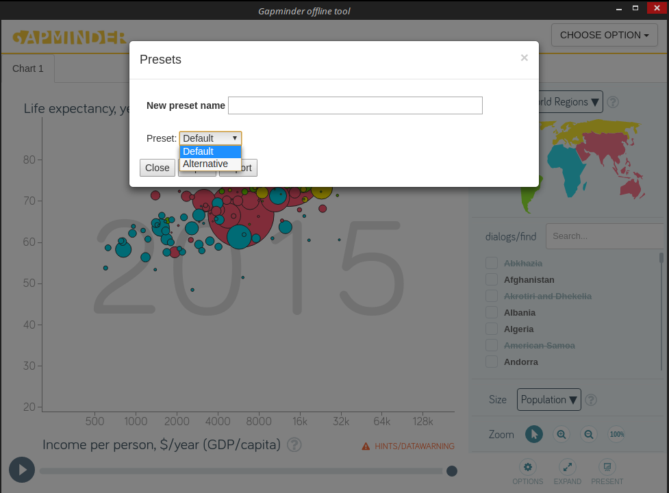
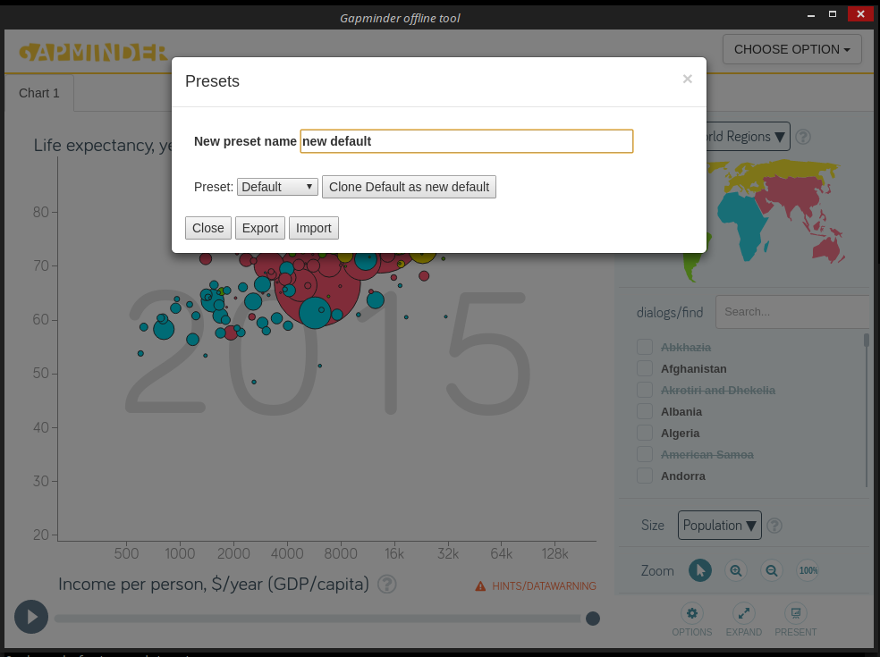
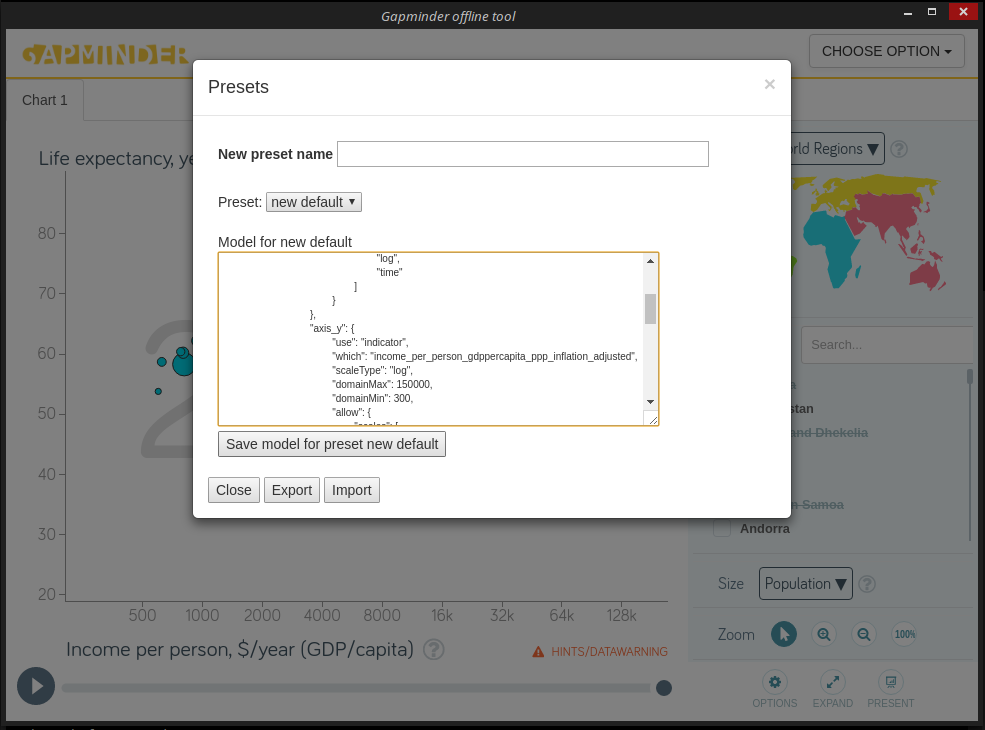
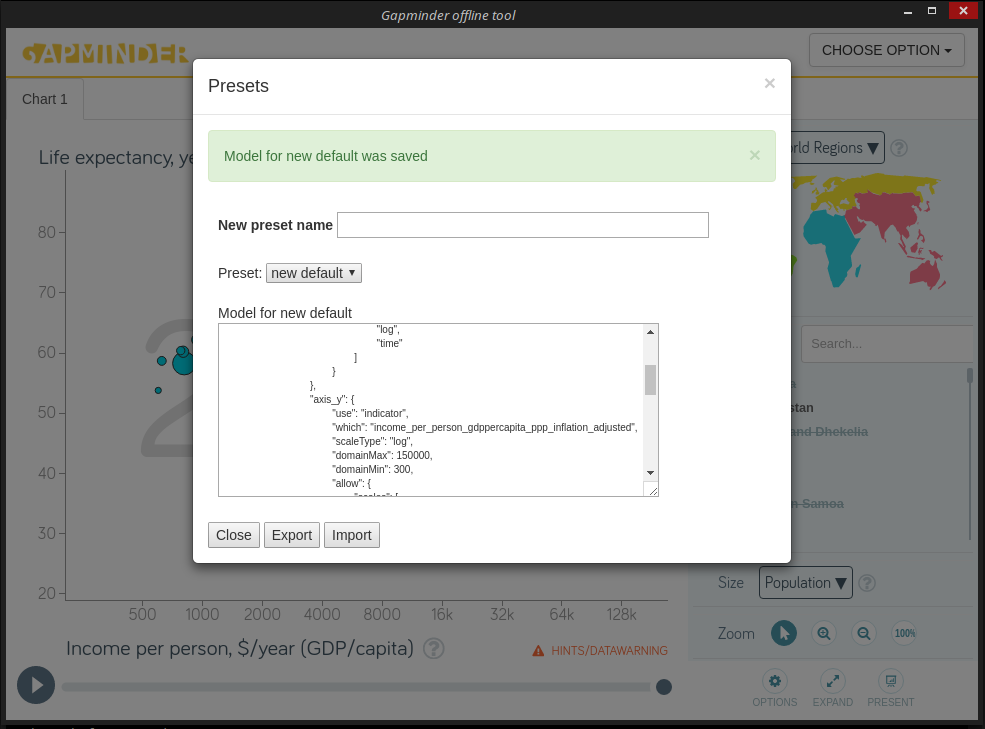
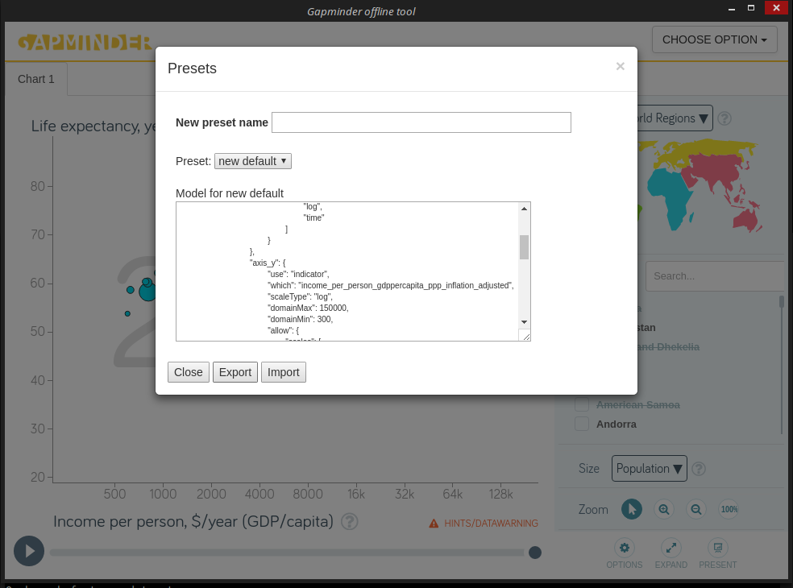
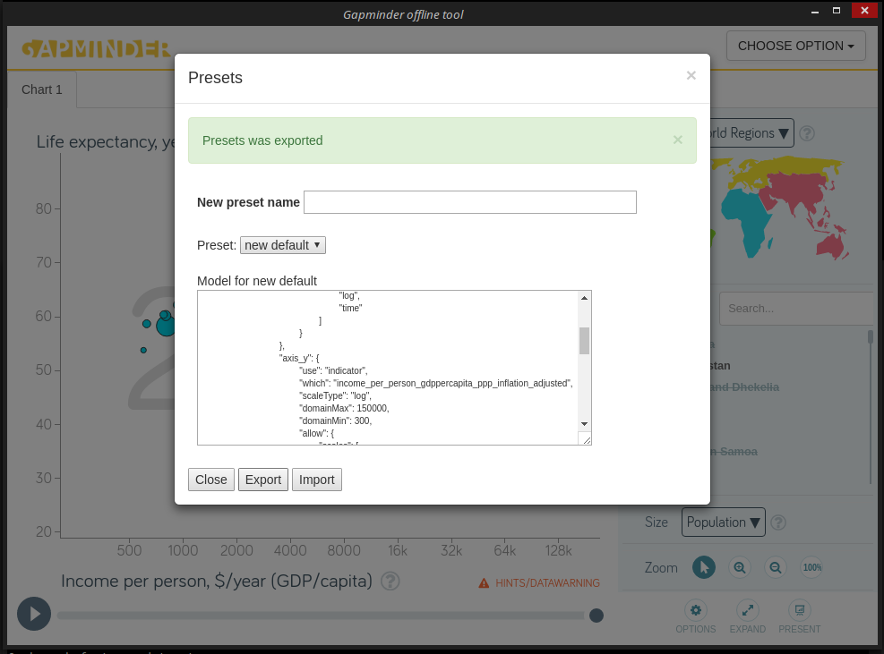
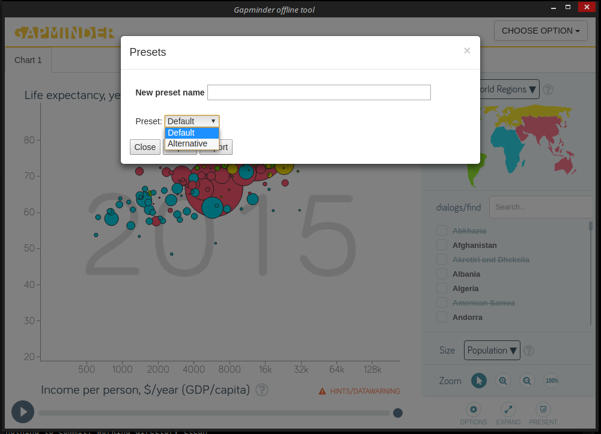
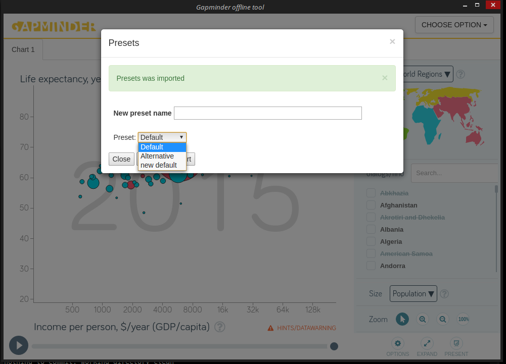
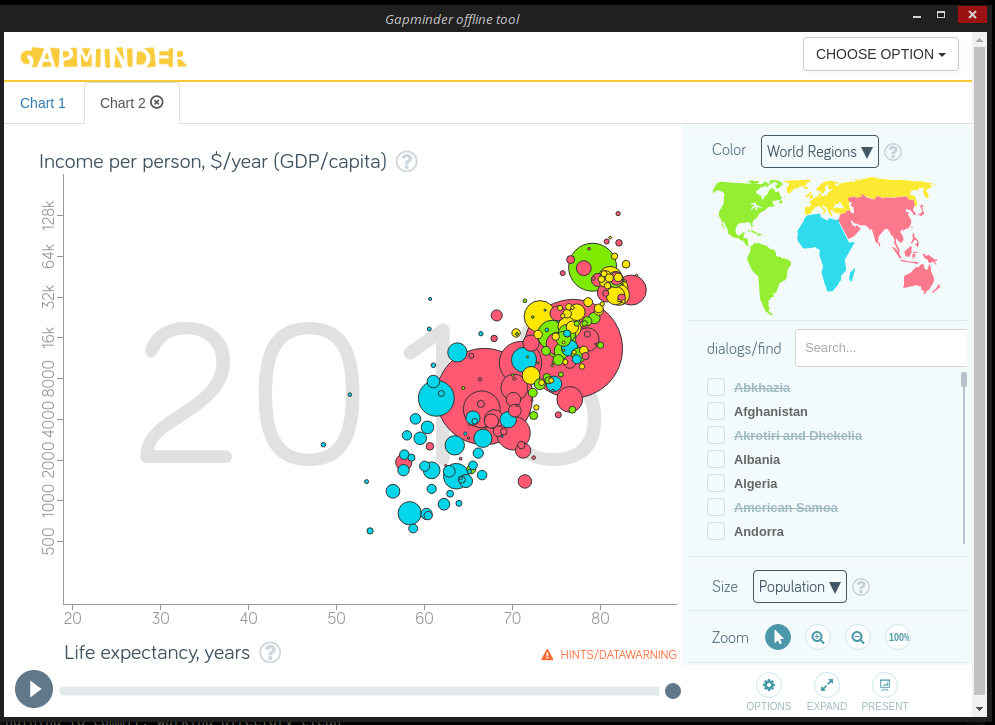

# Presets

## Usage

Choose `Presets` option in main menu.

Main goals are manipulate and store different `Vizabi` configurations.

All of this feature's functionality is placed in `Presets` dialog.
`Gapminder Offline` has only two presets by default: `Default` and `Alternative`. These presets are read only. You can clone any preset via next actions.

Select a base preset:
 

Enter a new preset's name:

Press a `Close ... as ...` button:

Now your current preset is a new preset and you can edit it freely. When you edit the model (config) you can see `Save model for preset ...` button.

Lets turn, for example, `axis_x` and `axis_y`. Press the button and you will see the message after that. 

Press `Export` button for our changes saving to disk.

### Note: all changes regarding presets will be saved to `presets.json` file on `Gapminder Offline` root filder.

Presets are exported now.

Now you can close the application.

Run the application again and open `Presets` dialog. Now you can see only default presets. Press `Import` button.

Now you can see previously saved preset.

Lets try to apply it: run `Custom DDF folder` option and choose new preset. Result will be next:

